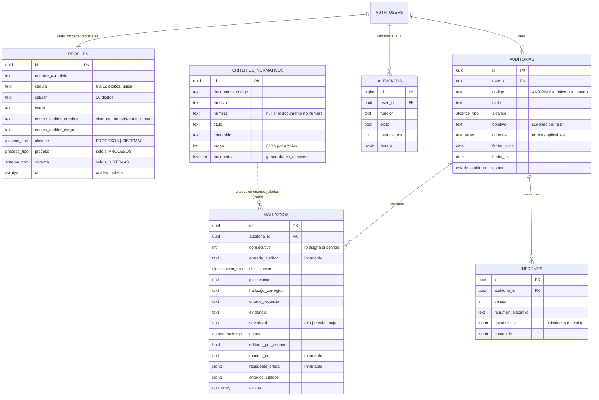

# Base de datos

PostgreSQL de Supabase con RLS en todas las tablas. Migraciones en `supabase/migrations/`, en orden:

| Migración | Contenido |
|---|---|
| `0001_tipos_y_perfiles.sql` | Enums (`alcance_tipo`, `proceso_tipo`, `sistema_tipo`, `clasificacion_tipo`, `rol_tipo`), `profiles` y el trigger que crea el perfil al registrarse |
| `0002_auditorias_y_hallazgos.sql` | `auditorias`, `hallazgos`, consecutivo por auditoría y protección de la trazabilidad |
| `0003_criterios_normativos.sql` | `criterios_normativos`, configuración de búsqueda `es_unaccent` y las funciones `buscar_criterios`, `explorar_criterios`, `resumen_documentos` |
| `0004_informes_y_logs.sql` | `informes` versionados e `ia_eventos` |
| `0005_rls.sql` | Políticas RLS, `es_admin()` y el bloqueo de cambio de rol |

## Modelo



## Reglas que impone la base de datos

- **Alcance coherente:** `PROCESOS` exige `proceso` y prohíbe `sistema`; `SISTEMAS`, al revés. Vale para
  perfiles y auditorías.
- **Consecutivo:** el trigger `asignar_consecutivo` calcula `max + 1` bloqueando la fila de la
  auditoría, así dos inserciones simultáneas no reciben el mismo número.
- **Trazabilidad inmutable:** `entrada_auditor`, `respuesta_cruda`, `modelo_ia`, `prompt_version`,
  `consecutivo`, `auditoria_id` y `user_id` no se pueden cambiar con `UPDATE`, ni siquiera el dueño.
- **Marca de edición automática:** cambiar `clasificacion`, `justificacion`, `hallazgo_corregido`,
  `criterio_requisito`, `evidencia` o `severidad` pone `editado_por_usuario = true`, lo haga o no el cliente.
- **Procedencia de IA:** desde el cliente solo se pueden insertar hallazgos sin `modelo_ia`,
  `prompt_version` ni `respuesta_cruda` (acción «duplicar»). Los generados por la IA los inserta la
  Edge Function con la service role.

## RLS

| Tabla | SELECT | INSERT | UPDATE | DELETE |
|---|---|---|---|---|
| `profiles` | propio o admin | propio, solo como `auditor` | propio, sin la columna `rol` | — |
| `auditorias` | dueño o admin | dueño | dueño | dueño |
| `hallazgos` | dueño o admin | dueño, sin procedencia de IA | dueño (campos inmutables protegidos) | dueño |
| `informes` | dueño o admin | dueño | dueño | dueño |
| `criterios_normativos` | autenticados | solo `service_role` | solo `service_role` | solo `service_role` |
| `ia_eventos` | admin | solo `service_role` | — | — |

Para nombrar un administrador, desde el editor SQL de Supabase:

```sql
update public.profiles set rol = 'admin' where cedula = '<cédula>';
```

### Dos correcciones al borrador del prompt maestro (§7.5)

Comprobadas ejecutando el SQL original contra Postgres:

1. **Escalada a admin.** `revoke update (rol) on profiles from authenticated` no tiene efecto, porque
   Supabase concede `UPDATE` a nivel de tabla y un `REVOKE` de columna no lo anula. Con el SQL del
   borrador, `update profiles set rol = 'admin'` **funciona**. La migración revoca el `UPDATE` de tabla,
   lo concede solo por columnas (sin `rol`) y añade el trigger `bloquear_cambio_rol`.
2. **Recursión infinita.** Una política de `profiles` que consulta `profiles` para saber si el usuario es
   admin falla con `infinite recursion detected in policy for relation "profiles"`. Se resuelve con la
   función `security definer` `public.es_admin()`.

Además, `criterios_normativos` usa una restricción única real `(archivo, orden)` en lugar del índice
de expresión `(archivo, coalesce(numeral,''), orden)`: un `upsert` con `ON CONFLICT` no puede apuntar a
un índice de expresión, y `orden` ya es único dentro de cada archivo.

## Búsqueda de texto completo

`busqueda` es una columna generada con la configuración `public.es_unaccent` (español + `unaccent`):
«gestion» empata con «gestión» y «revisión» con «revision». Título y numeral pesan más (`A`) que el
cuerpo (`B`); `ts_rank` normaliza por longitud para que los fragmentos largos no dominen.

`buscar_criterios(consulta, documentos, limite)` usa la sintaxis de `websearch_to_tsquery`: palabras
sueltas se combinan con **Y**; la palabra `or` combina con **O**. La Edge Function arma consultas con
`or` a partir del texto libre del auditor, porque exigir todas las palabras no recuperaría nada.

En Supabase las extensiones viven en el esquema `extensions`; la migración crea `unaccent` y
`pg_trgm` allí y referencia el diccionario como `extensions.unaccent`. Si `supabase db push` fallara en
ese paso, la alternativa documentada en el prompt es usar `'spanish'` y quitar tildes en la consulta.

## Cómo probar

Sin Docker ni proyecto en la nube (Postgres 18 en WASM con PGlite, emulando roles y `auth.*` de Supabase):

```bash
pnpm probar:bd
```

Contra el proyecto real, con dos usuarios de prueba que se crean y se borran:

```bash
SUPABASE_URL=https://<ref>.supabase.co SUPABASE_ANON_KEY=... SUPABASE_SERVICE_ROLE_KEY=... pnpm verificar-rls
```
