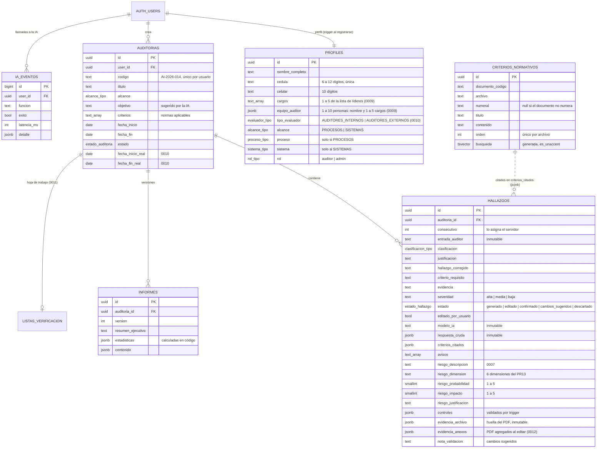

# Base de datos

PostgreSQL de Supabase con RLS en todas las tablas. Migraciones en `supabase/migrations/`, en orden:

| Migración | Contenido |
|---|---|
| `0001_tipos_y_perfiles.sql` | Enums (`alcance_tipo`, `proceso_tipo`, `sistema_tipo`, `clasificacion_tipo`, `rol_tipo`), `profiles` y el trigger que crea el perfil al registrarse |
| `0002_auditorias_y_hallazgos.sql` | `auditorias`, `hallazgos`, consecutivo por auditoría y protección de la trazabilidad |
| `0003_criterios_normativos.sql` | `criterios_normativos`, configuración de búsqueda `es_unaccent` y las funciones `buscar_criterios`, `explorar_criterios`, `resumen_documentos` |
| `0004_informes_y_logs.sql` | `informes` versionados e `ia_eventos` |
| `0005_rls.sql` | Políticas RLS, `es_admin()` y el bloqueo de cambio de rol |
| `0006_seguridad.sql` | Aprobación de cuentas, autorización de datos (Ley 1581), citas validadas, marcas de tiempo del servidor, sin borrado físico, historial de hallazgos, cuota de IA atómica y mínimo privilegio (ver `docs/SEGURIDAD.md`) |
| `0007_riesgo_controles_matriz.sql` | Estado `cambios_sugeridos`, riesgo del PR13_GQ (dimensión, probabilidad, impacto), controles validados, huella del PDF de evidencia, umbrales de riesgo por auditoría (retirados en la 0008) y la regla «editar un validado lo devuelve a pendiente» |
| `0008_escala_riesgo_fija.sql` | Retira `auditorias.umbrales_riesgo`: la escala de niveles de riesgo es fija y no editable (decisión del dueño) |
| `0009_cargos_y_equipo_auditor.sql` | Cargos de una lista institucional (`cargos text[]`) y equipo auditor de varias personas (`equipo_auditor jsonb`); retira `cargo`, `equipo_auditor_nombre` y `equipo_auditor_cargo` conservando lo que coincide con la lista |
| `0010_evaluador_y_fechas_reales.sql` | `profiles.tipo_evaluador` (Auditores Internos o Externos, obligatorio al crear o cambiar el perfil) y `auditorias.fecha_inicio_real`/`fecha_fin_real` para la Ficha Técnica del formato oficial |
| `0011_lista_verificacion.sql` | `listas_verificacion`: la hoja de trabajo del auditor (una por auditoría), validada por trigger, con RLS del dueño, sin borrado y en solo lectura si la auditoría está cerrada |
| `0012_pdf_evidencia_al_editar.sql` | `hallazgos.evidencia_anexos`: huellas de los PDF que el auditor carga al editar la evidencia (validadas por trigger); entran en el historial y en la regla «editar un validado lo devuelve a pendiente» |
| `0013_indicadores_revisados.sql` | `auditorias.indicadores_revisados`: indicadores priorizados del proceso que revisó el auditor (hasta 15 × nombre, meta, resultado y observación, validados por trigger), para la sección «Indicadores» del informe |
| `0014_quitar_pdf_analizado.sql` | El PDF analizado (`evidencia_archivo`) se puede quitar —no reemplazar— y entra en el historial y en la regla «editar un validado lo devuelve a pendiente» |

## Modelo



## Reglas que impone la base de datos

- **Lista de verificación (0011):** `encabezado` (elaborada por, proceso, auditados, fechas y lugar; textos de hasta
  300 caracteres) y `secciones` (hasta 30, cada una con título y hasta 200 filas de requisito, pregunta, documentos,
  marca `NC|O|OB|F` o vacía y anotaciones de hasta 2 000 caracteres). El trigger `validar_lista_verificacion` las
  normaliza y fija las fechas. Una por auditoría (`auditoria_id` es la llave); no se borra y, con la auditoría
  cerrada, no se edita.

- **Alcance coherente:** `PROCESOS` exige `proceso` y prohíbe `sistema`; `SISTEMAS`, al revés. Vale para
  perfiles y auditorías.
- **Consecutivo:** el trigger `asignar_consecutivo` calcula `max + 1` bloqueando la fila de la
  auditoría, así dos inserciones simultáneas no reciben el mismo número.
- **Trazabilidad inmutable:** `entrada_auditor`, `respuesta_cruda`, `modelo_ia`, `prompt_version`,
  `consecutivo`, `auditoria_id` y `user_id` no se pueden cambiar con `UPDATE`, ni siquiera el dueño.
- **Marca de edición automática:** cambiar `clasificacion`, `justificacion`, `hallazgo_corregido`,
  `criterio_requisito`, `evidencia`, `severidad`, los campos de riesgo o los controles pone
  `editado_por_usuario = true`, lo haga o no el cliente.
- **Cargos y equipo auditor (0009):** las listas viven en `public.cargos_lider()` (22) y `public.cargos_equipo()`
  (25), iguales a `CARGOS_LIDER` y `CARGOS_EQUIPO` de los catálogos (la prueba de validación lo comprueba). El
  trigger `validar_cargos_perfil` exige de 1 a 5 cargos del líder de su lista y de 1 a 10 personas en el equipo,
  cada una con nombre (3 a 120 caracteres) y de 1 a 5 cargos de la lista del equipo; quita repetidos y deja
  cada persona como `{nombre, cargos}`. Solo se aplica al crear el perfil o al cambiar esos campos: un perfil
  anterior sin cargos se puede aprobar, y la app le pide completarlo.
- **Riesgo (0007):** `riesgo_probabilidad` y `riesgo_impacto` entre 1 y 5; `riesgo_dimension` es una de las
  seis dimensiones del PR13_GQ (las mismas claves que `DIMENSIONES_IMPACTO` en los catálogos). El nivel no se
  guarda: lo calcula la aplicación con la escala fija `UMBRALES_RIESGO` (Bajo 1–4, Moderado 5–9, Alto 10–16,
  Extremo 17–25). La 0008 retiró `auditorias.umbrales_riesgo`: la escala no se edita por auditoría.
- **Controles (0007):** el trigger `validar_controles` admite como máximo 10, exige descripción de 5 a 600
  caracteres, tipo `PREVENTIVO|CORRECTIVO` y origen `ia|auditor`, verifica que `criterio_id` exista y le
  agrega el documento y el numeral de la base de datos. Al editar, un control `ia` solo puede cambiar
  `adoptado`: el auditor no puede hacer pasar un control propio por uno de la IA (la service role sí escribe
  controles `ia`).
- **Validación de la matriz (0007):** `confirmado` es «Validado». Si cambia el contenido de un hallazgo
  validado (redacción, riesgo o controles), `proteger_hallazgo` lo devuelve a `editado` (Pendiente).
- **PDF de evidencia (0007):** `evidencia_archivo` solo guarda `{nombre, paginas, sha256}` (check
  `evidencia_archivo_valida`); el archivo nunca llega al servidor. Desde la 0014 se puede quitar (pasar a null),
  nunca reemplazar por otro, y `hallazgos_historial` registra la huella anterior y quién la quitó.
- **PDF agregados al editar (0012):** `evidencia_anexos` es una lista de hasta 10 `{nombre, paginas, sha256,
  agregado_en}`. El trigger `validar_evidencia_anexos` sanea el nombre, exige páginas enteras de 1 a 500 y un
  SHA-256 válido, descarta cualquier otro campo (nada del contenido del PDF), no admite repetidos ni el PDF ya
  analizado, y pone la fecha del servidor (un PDF que ya estaba conserva la suya). Agregar o quitar uno es un
  cambio de contenido: queda en el historial y devuelve a pendiente un hallazgo validado.
- **Procedencia de IA:** desde el cliente solo se pueden insertar hallazgos sin `modelo_ia`,
  `prompt_version` ni `respuesta_cruda` (acción «duplicar»). Los generados por la IA los inserta la
  Edge Function con la service role.

## RLS

Desde la migración 0006, **solo las cuentas aprobadas** por un administrador (`profiles.aprobado`) acceden a
los datos: las políticas exigen `public.usuario_activo()`. El administrador también debe estar aprobado.

| Tabla | SELECT | INSERT | UPDATE | DELETE |
|---|---|---|---|---|
| `profiles` | propio o admin | propio, como `auditor` sin aprobar y con autorización de datos | propio, sin `rol`, `aprobado` ni la autorización | — |
| `auditorias` | dueño activo o admin | dueño activo | dueño activo | — |
| `hallazgos` | dueño activo o admin | dueño activo, sin procedencia de IA, en auditoría no cerrada | dueño activo (campos inmutables protegidos) | — |
| `hallazgos_historial` | dueño activo o admin | solo el trigger | — | — |
| `informes` | dueño activo o admin | solo `service_role` | — | — |
| `criterios_normativos` | usuarios activos | solo `service_role` | solo `service_role` | solo `service_role` |
| `ia_eventos` | admin | solo `service_role` | — | — |

El rol `anon` no tiene ningún permiso en el esquema `public`. Aprobar o desactivar cuentas se hace con
`aprobar_auditor(id, aprobado)`, que verifica que quien llama es admin. Para el primer administrador:

```sql
update public.profiles set rol = 'admin', aprobado = true where cedula = '<cédula>';
```

### Dos correcciones al borrador del prompt maestro (§7.5)

Comprobadas ejecutando el SQL original contra Postgres:

1. **Escalada a admin.** `revoke update (rol) on profiles from authenticated` no tiene efecto, porque
   Supabase concede `UPDATE` a nivel de tabla y un `REVOKE` de columna no lo anula. Con el SQL del
   borrador, `update profiles set rol = 'admin'` **funciona**. La migración revoca el `UPDATE` de tabla,
   lo concede solo por columnas (sin `rol`) y añade el trigger `bloquear_cambio_rol`.
2. **Recursión infinita.** Una política de `profiles` que consulta `profiles` para saber si el usuario es
   admin falla con `infinite recursion detected in policy for relation "profiles"`. Se resuelve con la
   función `security definer` `public.es_admin()`.

Además, `criterios_normativos` usa una restricción única real `(archivo, orden)` en lugar del índice
de expresión `(archivo, coalesce(numeral,''), orden)`: un `upsert` con `ON CONFLICT` no puede apuntar a
un índice de expresión, y `orden` ya es único dentro de cada archivo.

## Búsqueda de texto completo

`busqueda` es una columna generada con la configuración `public.es_unaccent` (español + `unaccent`):
«gestion» empata con «gestión» y «revisión» con «revision». Título y numeral pesan más (`A`) que el
cuerpo (`B`); `ts_rank` normaliza por longitud para que los fragmentos largos no dominen.

`buscar_criterios(consulta, documentos, limite)` usa la sintaxis de `websearch_to_tsquery`: palabras
sueltas se combinan con **Y**; la palabra `or` combina con **O**. La Edge Function arma consultas con
`or` a partir del texto libre del auditor, porque exigir todas las palabras no recuperaría nada.

En Supabase las extensiones viven en el esquema `extensions`; la migración crea `unaccent` y
`pg_trgm` allí y referencia el diccionario como `extensions.unaccent`. Si `supabase db push` fallara en
ese paso, la alternativa documentada en el prompt es usar `'spanish'` y quitar tildes en la consulta.

## Cómo probar

Sin Docker ni proyecto en la nube (Postgres 18 en WASM con PGlite, emulando roles y `auth.*` de Supabase):

```bash
pnpm probar:bd
```

Contra el proyecto real, con dos usuarios de prueba que se crean y se borran:

```bash
SUPABASE_URL=https://<ref>.supabase.co SUPABASE_ANON_KEY=... SUPABASE_SERVICE_ROLE_KEY=... pnpm verificar-rls
```

## Ingesta de las normas

`scripts/ingest-normas.mjs` trocea los cinco archivos de `normas/` con `scripts/lib/trocear-normas.mjs`
y los sube a `criterios_normativos` en lotes de 100 (`upsert` por `archivo, orden`).

```bash
pnpm ingest:dry                                   # trocea e imprime el resumen, sin subir nada
SUPABASE_URL=... SUPABASE_SERVICE_ROLE_KEY=... pnpm ingest
pnpm probar:busqueda                              # carga todo en PGlite y prueba consultas
```

Resultado actual del troceado:

| Documento | Idioma | Fragmentos | Numerales | Qué se incluye |
|---|---|---|---|---|
| NTC-ISO 9001:2015 | es | 55 | 55 | Capítulos 4 a 10 |
| ISO 45001:2018 | es | 44 | 40 | Capítulos 4 a 10 |
| NTC-ISO 14001:2015 | es | 31 | 31 | Capítulos 4 a 10 |
| ISO 19011 | en | 94 | 85 | Capítulos 4 a 7 y Anexo A (incluye A.18 *Audit findings*) |
| PR13-GQ | es | 22 | 5 | Secciones 1 a 5; el marco conceptual partido por subtítulos |

Reglas del troceado:

- **Solo capítulos con requisitos.** Se descartan prólogo, índice, introducción (0.x), objeto,
  referencias, términos y definiciones, anexos informativos y bibliografía: no son requisitos citables.
  ISO 19011 es una guía y su Anexo A trata el registro de hallazgos, por eso se conserva.
- **Encabezados con defectos de conversión:** numeral y término en líneas separadas, contenido dentro
  del encabezado, anexos sin numeral que se «comían» el último numeral. Detalle en
  `docs/RECONOCIMIENTO.md` §C.
- **Limpieza:** números de página, cabeceras repetidas, renglones de índice con puntos guía, la marca
  de agua «Copia autorizada a…» de la copia licenciada de 14001 (48 líneas), etiquetas HTML, `**` y `_`.
- **Fragmentos de máximo 2 400 caracteres**, partidos por párrafos y con el mismo numeral y título
  (`parte` = 1, 2…). El prompt sugería 6 000, pero `buscar_criterios` entrega a la IA solo los primeros
  2 500 caracteres de cada fragmento: lo que pasara de ahí nunca llegaría al modelo.
- **Títulos genéricos** («Generalidades») llevan el título del padre: «Mejora — Generalidades».
- **PR13-GQ** es OCR de tablas: se quitan cabeceras, firmas y vigencias de cada página, y las celdas se
  unen en párrafos. Las actividades del procedimiento (numeral 5) quedan legibles pero no en orden de
  tabla: son criterios de **baja precisión**.

### Limitación: ISO 19011 está en inglés

La búsqueda es léxica en español. Una consulta en español casi nunca empata con texto en inglés
(«hallazgo» no es «finding»), así que ISO 19011 rara vez se recupera a partir de la entrada del auditor.
No produce errores, solo menos contexto. Se resuelve con búsqueda semántica multilingüe (`pgvector`,
Fase 8) o con una traducción oficial de la norma.
